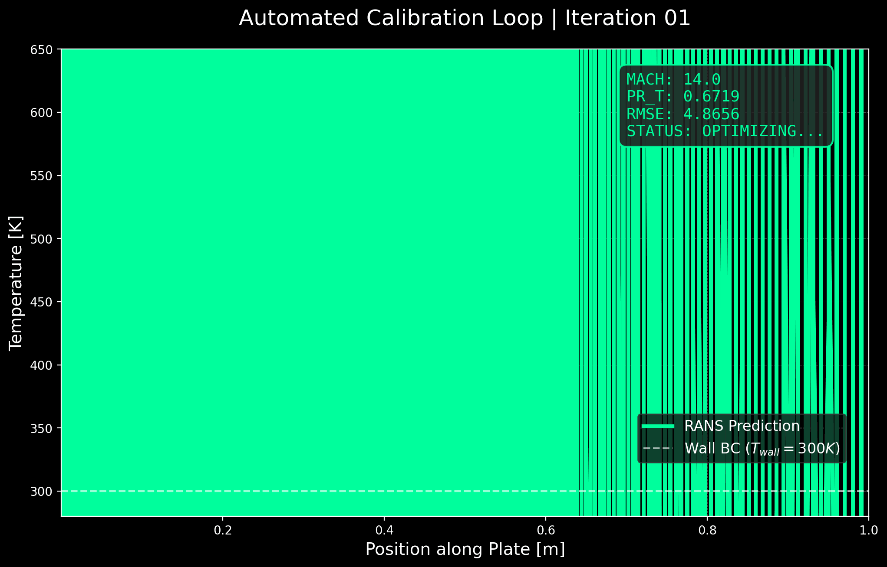
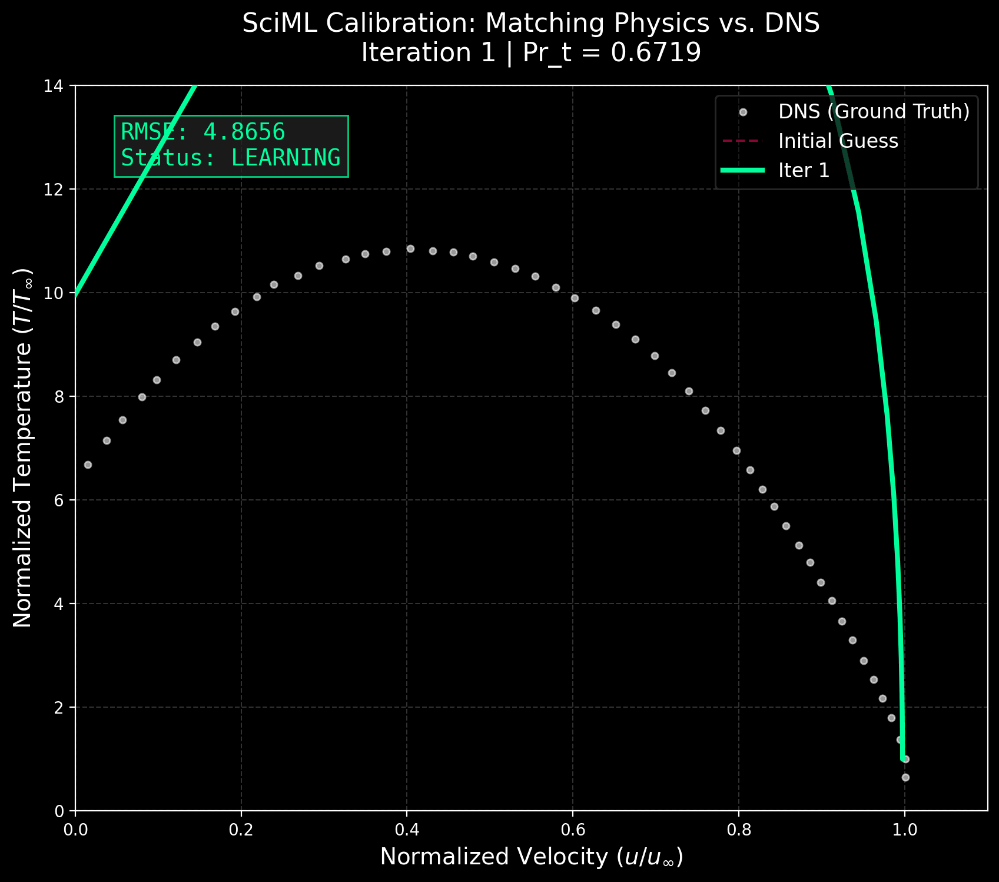

# Hypersonic Turbulent Prandtl Number Optimization


<p align="center">
  
</p>

Automated calibration of RANS turbulence models for hypersonic cold-wall boundary layers using data-driven inverse modeling.

---

## Key Results

| Metric | Baseline | Optimized | Improvement |
|--------|----------|-----------|-------------|
| Temperature RMSE | 0.387 | 0.286 | **-26%** |
| Turbulent Prandtl Number | 0.9 | 0.566 | Calibrated |

<p align="center">
  
</p>

---

## The Problem

Standard RANS turbulence models assume a constant turbulent Prandtl number (Pr_t = 0.9). This assumption breaks down for hypersonic flows with cold walls, leading to significant errors in heat flux prediction - critical for thermal protection system design.

## The Solution

This project implements an **automated calibration pipeline** that:
1. Wraps the SU2 CFD solver in a Python interface
2. Runs parametric simulations automatically
3. Computes loss against DNS ground truth
4. Optimizes Pr_t using Brent's method (SciPy)

```
┌─────────────────┐     ┌──────────────┐     ┌─────────────────┐
│   SciPy         │────>│  SU2 RANS    │────>│  Loss Function  │
│   Optimizer     │     │  Solver      │     │  (RMSE vs DNS)  │
│  (Brent's)      │<────│  (Mach 14)   │<────│                 │
└─────────────────┘     └──────────────┘     └─────────────────┘
```

---

## Test Case

| Parameter | Value |
|-----------|-------|
| Mach Number | 13.6 |
| Wall Temperature Ratio (Tw/Taw) | 0.186 |
| Reynolds Number | 5×10⁶ |
| Turbulence Model | Spalart-Allmaras |
| Validation Data | DNS (Murphy & Agarwal, 2025) |

---

## Technologies

- **CFD Solver:** [SU2](https://su2code.github.io/) (open-source, MPI-parallel)
- **Optimization:** SciPy (Brent's bounded method)
- **Data Processing:** Pandas, NumPy
- **Visualization:** Matplotlib (AIAA publication style)
- **Environment:** Linux/WSL2, Python 3.8+

---

## Quick Start

```bash
# Install dependencies
pip install -r requirements.txt

# Run optimization (requires SU2 with MPI)
cd src
python run_optimization.py
```

---

## Project Structure

```
├── src/
│   ├── run_optimization.py    # Main optimization loop
│   ├── su2_interface.py       # SU2 wrapper class
│   └── generate_ramp.py       # Mesh generator for future work
├── config/                    # SU2 configuration files
├── data/                      # DNS validation dataset
└── post_processing/           # Visualization scripts
```

---

## References

- Murphy, A. R. & Agarwal, R. K. (2025). *Application and Evaluation of the Wray-Agarwal Turbulence Model with Compressibility Corrections in SU2 for RANS Hypersonic Flow Prediction.* AIAA Aviation Forum.

---

## Author

**Matar Hedi**  
M.Sc. Researcher, Technion | Thermal Engineer, Elbit Systems  
[LinkedIn](https://www.linkedin.com/in/matar-hedi)

---

## License

MIT
