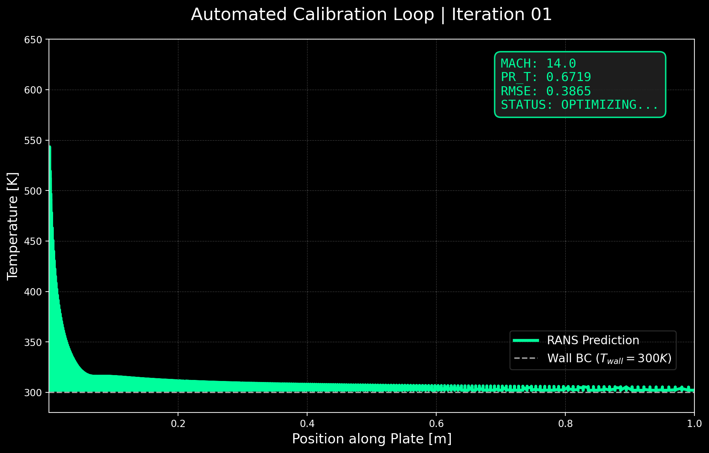
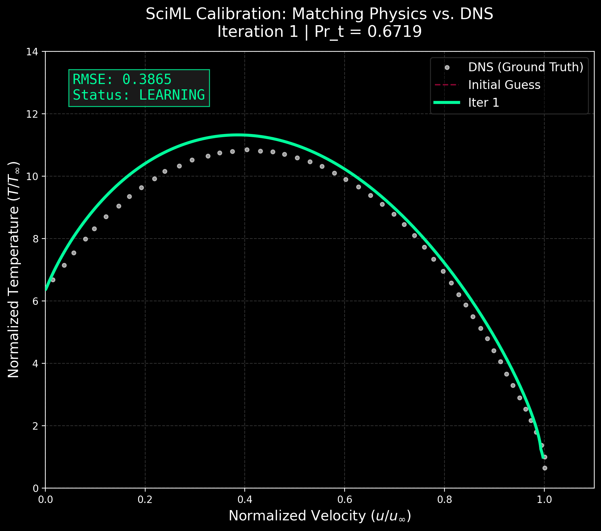

# Hypersonic Turbulent Prandtl Number Optimization


<p align="center">
  
</p>

Automated calibration of RANS turbulence models for hypersonic cold-wall boundary layers using data-driven inverse modeling.

---

## Key Results

| Metric | Baseline (Pr_t=0.9) | Calibrated (Pr_t=0.566) | Improvement |
|--------|----------------------|--------------------------|-------------|
| Temperature RMSE | 0.739 | 0.286 | **-61.3%** |
| Turbulent Prandtl Number | 0.9 (SA default) | 0.566 (optimized) | Data-driven calibration |

<p align="center">
  
</p>

---

## The Problem

Standard RANS turbulence models assume a constant turbulent Prandtl number (Pr_t = 0.9). This assumption breaks down for hypersonic flows with cold walls, leading to significant errors in heat flux prediction - critical for thermal protection system design.

## The Solution

This project implements an **automated calibration pipeline** with two execution modes:

**Mode 1 — Single-condition optimization (validated at Mach 14)**
1. Wraps the SU2 CFD solver in a Python interface
2. Runs parametric simulations automatically
3. Computes loss against DNS ground truth
4. Optimizes Pr_t using Brent's method (SciPy)

```
┌─────────────────┐     ┌──────────────┐     ┌─────────────────┐
│   SciPy         │────>│  SU2 RANS    │────>│  Loss Function  │
│   Optimizer     │     │  Solver      │     │  (RMSE vs DNS)  │
│  (Brent's)      │<────│  (Mach 14)   │<────│                 │
└─────────────────┘     └──────────────┘     └─────────────────┘
```

**Mode 2 — GP surrogate + active learning (scaffold, not yet validated)**

Extends Mode 1 to multiple flow conditions using a Gaussian Process (BoTorch) that maps `[Mach, Tw/Taw, pressure-gradient angle]` → optimal Pr_t, with UCB acquisition to decide where to run new SU2 simulations. Code is in place but has **not been run end-to-end yet**.

```
┌──────────────┐     ┌──────────────┐     ┌──────────────┐
│ FlowCondition│────>│  GP Surrogate│────>│  UCB         │
│ (case_config)│     │  (BoTorch)   │     │  Acquisition │
└──────────────┘     └──────────────┘     └──────┬───────┘
                                                  │ high uncertainty
                                                  v
                                          ┌──────────────┐
                                          │ SU2 + Brent  │
                                          │ (inner loop) │
                                          └──────────────┘
```

---

## Test Case

| Parameter | Value |
|-----------|-------|
| Mach Number | 13.6 |
| Wall Temperature Ratio (Tw/Taw) | 0.186 |
| Reynolds Number | 5×10⁶ |
| Turbulence Model | Spalart-Allmaras |
| Validation Data | DNS (Murphy & Agarwal, 2025) |

---

## Technologies

- **CFD Solver:** [SU2](https://su2code.github.io/) (open-source, MPI-parallel)
- **Optimization:** SciPy (Brent's bounded method)
- **Surrogate Model:** PyTorch + GPyTorch + BoTorch (GP, active learning)
- **Data Processing:** Pandas, NumPy
- **Visualization:** Matplotlib (AIAA publication style)
- **Environment:** Linux/WSL2, Python 3.9+

---

## Quick Start

```bash
# Install dependencies
pip install -r requirements.txt

# Mode 1: Single-condition optimization (validated)
cd src
python run_optimization.py

# Mode 2: Active learning (scaffold — not yet validated)
python run_active_learning.py --dry-run    # GP logic only, no SU2
python run_active_learning.py --budget 10    # full loop (requires SU2 + MPI)
python run_active_learning.py --resume       # resume from checkpoints/
```

SU2 must be on PATH. Parallel runs use `mpirun -n 4 SU2_CFD`.

---

## Project Structure

```
├── src/
│   ├── run_optimization.py       # Mode 1: Brent optimization (validated)
│   ├── run_active_learning.py    # Mode 2: GP + active learning (untested)
│   ├── case_config.py            # FlowCondition dataclass + feature vector
│   ├── surrogate.py              # GP surrogate (BoTorch)
│   ├── active_loop.py            # UCB acquisition loop
│   ├── su2_interface.py          # SU2 wrapper (accepts FlowCondition)
│   └── generate_ramp.py          # Mesh generator (future work)
├── checkpoints/                  # GP model + AL log (created at runtime)
├── config/                       # SU2 configuration files
├── data/                         # DNS validation dataset
└── post_processing/              # Visualization scripts
```

---

## References

- Murphy, A. R. & Agarwal, R. K. (2025). *Application and Evaluation of the Wray-Agarwal Turbulence Model with Compressibility Corrections in SU2 for RANS Hypersonic Flow Prediction.* AIAA Aviation Forum.

---

## Author

**Matar Hedi**  
M.Sc. Researcher, Technion | Thermal Engineer, Elbit Systems  
[LinkedIn](https://www.linkedin.com/in/matar-hedi)

---

## License

MIT
